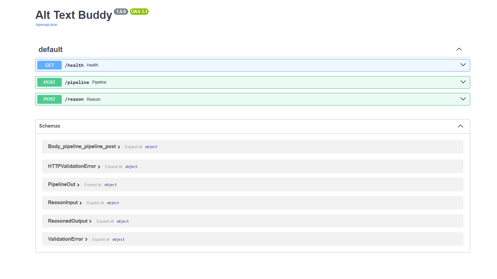

## Alt-Text Buddy — One-shot Pipeline Mode
Compare Azure Vision, AWS Rekognition, and Google Vision outputs to generate alt text, with optional GPT refinement (Streamlit UI + FastAPI).


---

---

## Requirements
See [`requirements.txt`](./requirements.txt). 

Create and activate a virtual environment, then install:
```
python -m venv venv
# Windows: venv\Scripts\activate
# macOS/Linux: source venv/bin/activate
pip install -r requirements.txt
```

## Config
Create .env from the example and fill your keys:
```
cp .env.example .env
```

## Quick start
### Run backend
```
uvicorn app.main:app --reload --port 8000
# Health: http://localhost:8000/health
# Docs:   http://localhost:8000/docs
```
### Run UI
```
streamlit run ui/app.py
# In the sidebar, set API base: http://localhost:8000
```

## Endpoints
- POST /pipeline → { results: { <provider>: { raw: {...}, reasoned: {...|null} } } }
  -- Runs one or more providers and (optionally) GPT reasoning for each.
  -- Form fields:
    - image: uploaded file (png/jpg/webp)
    - providers: comma-separated list, any of azure,aws,google
    - reason: true|false — refine with GPT
    - use_case: web|ecommerce|news|education|docs
    - tone: neutral|friendly|professional|informative
    - max_len: integer (e.g., 160)
  -- Response shape:
    '''
    {
      "results": {
        "azure": {
          "raw": { "alt_text": "...", "tags": ["..."], "ocr_lines": ["..."], "provider": "azure" },
          "reasoned": { "alt_text": "...", "explain_why": "...", "tags": ["..."], "provider": "gpt" }
        },
        "aws": {
          "raw": { "alt_text": "...", "tags": ["..."], "ocr_lines": ["..."], "provider": "aws" },
          "reasoned": null
        },
        "google": { "error": "SomeError: message..." }
      }
    }
    '''
  -- cURL
  '''
  curl -X POST "http://localhost:8000/pipeline" \
    -F "image=@screenshots/ui.png" \
    -F "providers=azure,aws,google" \
    -F "reason=true" \
    -F "use_case=web" \
    -F "tone=neutral" \
    -F "max_len=160"
  '''
- POST /reason → { alt_text, explain_why, tags, provider: "gpt" } : Refines alt text with GPT using your CV findings.
  -- Standalone GPT refinement
  -- JSON body:
    '''
    {
      "alt_text": "label-based caption or azure caption",
      "tags": ["tag1", "tag2"],
      "ocr_lines": ["line one", "line two"],
      "use_case": "web",
      "tone": "neutral",
      "max_len": 160
    }
    '''
  -- Response
  '''
  { "alt_text": "...", "explain_why": "...", "tags": ["..."], "provider": "gpt" }

  '''

Convention: outward-facing JSON uses alt_text. Provider captions are treated as hints and flow into GPT via /pipeline or /reason.

## Project structure
```
alt-text-buddy/
├─ app/
│  ├─ __init__.py
│  ├─ main.py              # FastAPI app + endpoints
│  ├─ config.py            # env loading
│  ├─ cache.py             # TTL cache for findings (sha256-keyed)
|  ├─ cache_helpers.py     # get_or_run(image_hash, provider) cache wrapper
│  ├─ utils.py             # misc helpers (image sha256)
|  ├─ utils_http.py        # upload validation (content type / size)
│  ├─ providers/
│  │  ├─ __init__.py
│  │  ├─ base.py            # VisionFinding dataclass
│  │  ├─ azure_vision.py    # Azure Image Analysis adapter
│  │  ├─ aws_rekognition.py # AWS Rekognition adapter
│  │  └─ google_vision.py   # Google Vision adapter
│  └─ gpt/
│     ├─ __init__.py
│     └─ reasoner.py       # prompt builder for GPT
├─ ui/
│  ├─ __init__.py
│  ├─ app.py               # Streamlit UI
│  ├─ components.py        # render helpers
|  ├─ services.py          # 
│  └─ metrics.py           # phrase-aware metrics
├─ screenshots/
│  ├─ ui.png
│  └─ docs_endpoints.png
├─ requirements.txt
├─ .env.example
├─ LICENSE
└─ README.md
```

## Notes
- Caching: results are cached in-memory (TTL) per image SHA-256 and provider to reduce cost/latency. See cache_helpers.get_or_run.
- Reasoner: GPT prompt favors brand/product text from OCR and uses tags/caption as context. If OCR is empty, it still produces helpful content (never says “no OCR”).
- UI debug: toggle “Show debug” in the sidebar to view raw provider and inspect payloads for each run.
- Metrics: the UI reports
  - character/word counts
  - phrase-aware tag hit-rate (handles multi-word tags like “cream & onion”)
  - OCR hit-rate (overlap between Azure READ text and alt text)

## Roadmap
- ✅ Azure Image Analysis + GPT reasoning
- ✅ AWS Rekognition adapter (labels + text)
- ✅ Google Vision adapter (labels + text detection)
- ✅ One-shot /pipeline endpoint returning all provider results at once
- ⏩ Weighted/combined scoring across providers
- ⏩ Batch evaluation & export (CSV/JSON)
- ⏩ Optional prompt tuning & few-shot templates

## License

MIT – see [LICENSE](./LICENSE).
