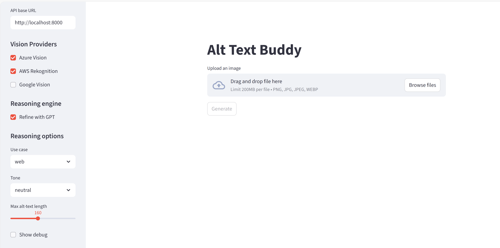
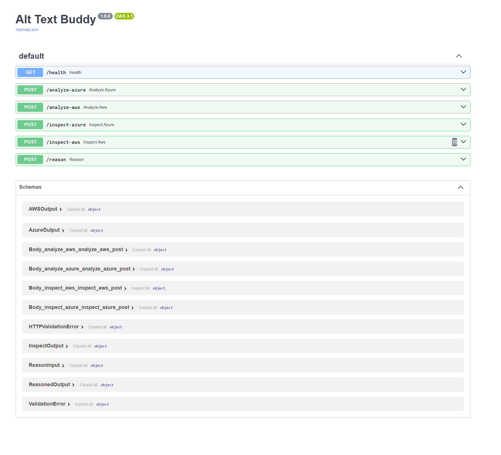

## Alt-Text Buddy — Per-Provider Mode
Compare Azure Vision, AWS Rekognition, and Google Vision outputs to generate alt text, with optional GPT refinement (Streamlit UI + FastAPI).


---

---

## Requirements
See [`requirements.txt`](./requirements.txt). 

Create and activate a virtual environment, then install:
```
python -m venv venv
# Windows: venv\Scripts\activate
# macOS/Linux: source venv/bin/activate
pip install -r requirements.txt
```

## Config
Create .env from the example and fill your keys:
```
cp .env.example .env
```

## Quick start
### Run backend
```
uvicorn app.main:app --reload --port 8000
# Health: http://localhost:8000/health
# Docs:   http://localhost:8000/docs
```
### Run UI
```
streamlit run ui/app.py
# In the sidebar, set API base: http://localhost:8000
```

## Endpoints
- POST /analyze-azure → { alt_text, tags, provider } : Uses Azure Image Analysis (caption + tags). alt_text is the Azure caption.
- POST /analyze-aws → { alt_text, tags, provider } : Uses AWS Rekognition (labels → tags; text → OCR lines internally). alt_text is a simple label-based caption.
- POST /analyze-google → { alt_text, tags, provider } : Uses Google Vision (labels → tags; Text Detection → OCR).
- POST /reason → { alt_text, explain_why, tags, provider: "gpt" } : Refines alt text with GPT using your CV findings.
- POST /inspect-azure → { alt_text, tags, ocr_lines, provider }
- POST /inspect-aws → { alt_text, tags, ocr_lines, provider }
- POST /inspect-google → { alt_text, tags, ocr_lines, provider }

Convention: outward-facing JSON uses alt_text. The raw provider caption is used as a hint and exposed only via the /inspect-* endpoints for debugging.

## Project structure
```
alt-text-buddy/
├─ app/
│  ├─ __init__.py
│  ├─ main.py              # FastAPI app + endpoints
│  ├─ config.py            # env loading
│  ├─ cache.py             # TTL cache for findings (sha256-keyed)
|  ├─ cache_helpers.py     # get_or_run(image_hash, provider) cache wrapper
│  ├─ utils.py             # misc helpers (image sha256)
|  ├─ utils_http.py        # upload validation (content type / size)
│  ├─ providers/
│  │  ├─ __init__.py
│  │  ├─ base.py            # VisionFinding dataclass
│  │  ├─ azure_vision.py    # Azure Image Analysis adapter
│  │  ├─ aws_rekognition.py # AWS Rekognition adapter
│  │  └─ google_vision.py   # Google Vision adapter
│  └─ gpt/
│     ├─ __init__.py
│     └─ reasoner.py       # prompt builder for GPT
├─ ui/
│  ├─ __init__.py
│  ├─ app.py               # Streamlit UI
│  ├─ components.py        # render helpers
|  ├─ services.py          # 
│  └─ metrics.py           # phrase-aware metrics
├─ screenshots/
│  ├─ ui.png
│  └─ docs_endpoints.png
├─ requirements.txt
├─ .env.example
├─ LICENSE
└─ README.md
```

## Notes
- Caching: results are cached in-memory (TTL) per image SHA-256 and provider to reduce cost/latency. See cache_helpers.get_or_run.
- Reasoner: GPT prompt favors brand/product text from OCR and uses tags/caption as context. If OCR is empty, it still produces helpful content (never says “no OCR”).
- UI debug: toggle “Show debug” in the sidebar to view raw provider and inspect payloads for each run.
- Metrics: the UI reports
  - character/word counts
  - phrase-aware tag hit-rate (handles multi-word tags like “cream & onion”)
  - OCR hit-rate (overlap between Azure READ text and alt text)

## Roadmap
- ✅ Azure Image Analysis + GPT reasoning
- ✅ AWS Rekognition adapter (labels + text)
- ✅ Google Vision adapter (labels + text detection)
- ⏩ Sidebar metric pickers & weighted scoring
- ⏩ One-shot /pipeline endpoint returning all provider results at once
- ⏩ Download results (JSON/CSV) for batch evaluation

## License

MIT – see [LICENSE](./LICENSE).
